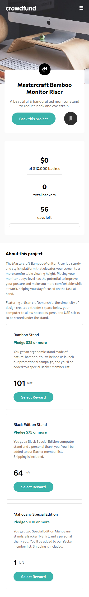

# Frontend Mentor - Crowdfunding product page solution

This is a solution to the [Crowdfunding product page challenge on Frontend Mentor](https://www.frontendmentor.io/challenges/crowdfunding-product-page-7uvcZe7ZR).

## Table of contents

- [Overview](#overview)
  - [The challenge](#the-challenge)
  - [Links](#links)
  - [Screenshot](#screenshot)
- [My process](#my-process)
  - [Built with](#built-with)
  - [What I learned](#what-i-learned)
- [Author](#author)

## Overview

### The challenge

Users should be able to:

- View the optimal layout depending on their device's screen size
- See hover states for interactive elements
- Make a selection of which pledge to make
- See an updated progress bar and total money raised based on their pledge total after confirming a pledge
- See the number of total backers increment by one after confirming a pledge
- Toggle whether or not the product is bookmarked

### Links
- Solution URL: [Solution](https://github.com/Medido1/Frontend-Mentor-Crowdfunding-product-page)
- Live Site URL: [Live site](https://medido1.github.io/Frontend-Mentor-Crowdfunding-product-page/)

### Screenshot
  ## Desktop
  
  ## Mobile
  
## My process

### Built with

- Semantic HTML5 markup
- CSS custom properties
- Flexbox
- CSS Grid
- Mobile-first workflow

### What I learned

I tried to make some sort of animation showing the progress bar filling up depending on the % of the total 
money remaining 

function fillProgressBar(){
  let percentage = (Number(totalMoneyPledged) * 100) / 10000;
  let currentWidth = parseFloat(progressBar.style.width) || 0;
  function fillBar() {
    currentWidth += 1;
    progressBar.style.width = `${currentWidth}%`;
    if (currentWidth >= percentage) {
      clearInterval(intervalId)
    }
  }
  const intervalId = setInterval(fillBar, 50);
}
## Author

- Frontend Mentor - [@Medido1](https://www.frontendmentor.io/profile/Medido1)
- Github - [@Medido1](https://www.frontendmentor.io/profile/Medido1)

